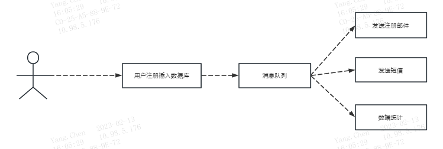

## 1、应用场景
### 1.1、异步处理
场景说明：用户注册后，需要发注册邮件和注册短信，传统的做法有两种
* 串行的方式
* 并行的方式

**(1)串行方式**：

　　将注册信息写入数据库后，发送注册邮件，再发送注册短信，以上三个任务全部完成后才返回给客户端。
这有个严重的问题是，如果后续会有更多的功能模块加入到注册流程中，用户注册所需要的时间就会延长。
并且这些流程不一定是必须的。 使用串行的模式需要50ms+50ms+50ms+50ms=200ms

**(2)并行方式**，如下图
　　假设4个业务节点分别使用50ms，串行方式使用时间200ms，并行使用时间100ms。虽然并性已经提高的处理时间，
但是前面说过邮件和短信对我正常的使用网站没有任何影响，客户端没有必要等着其发送完成才显示注册成功，
应该是写入数据库后就返回。使用并行的模式需要50ms+50ms=100ms

**(3)消息队列**：

引入消息队列后，把发送邮件，短信，数据统计等非必须的业务逻辑异步处理。

假设写入消息队列的耗时为10ms，则使用消息队列的模式需要50ms+10ms=60ms即可返回响应，且后续可以继续拓展其他业务

### 1.2、应用间解耦
##### 商城系统-耦合：
　　用户下单后，订单系统需要通知库存系统，传统的做法就是订单系统调用库存系统的接口这种方式可能存在一个问题：
如果库存系统有问题，订单相关的也会引起故障，比如查看订单，涉及到库存等。并且这2个系统的高度耦合的。

##### 引入消息队列-解耦：

订单系统：用户通过订单系统下单后， 订单系统把数据入库，并发送mq消息，返回下单成功。

库存系统：订阅订单系统的下单消息，收到消息后，对库存进行增减操作并入库。即使库存系统故障，不影响消息的投递，
订单系统的消息不会丢失，下次恢复后数据消费正常

### 1.3、流量削峰
在秒杀活动中应用广泛，一般会因为流量过大，导致应用挂掉，为了解决这个问题，在应用前端加入消息队列。
作用:
1、可以控制活动人数，超过此一定阀值的订单直接丢弃。
2、可以缓解短时间的高流量压垮应用(应用程序按自己的最大处理能力获取订单)

### 1.4 消息队列优缺点

关于消息队列的优点就是在特殊场景下有其对应的好处，解耦、异步、削峰。

*缺点有以下几个*：
* 系统可用性降低：系统引入的外部依赖越多，越容易挂掉。本来你就是 A 系统调用 BCD 三个系统的接口就好了，人 ABCD 四个系统好好的，没啥问题，你偏加个 MQ 进来，万一 MQ 挂了咋整，MQ 一挂，整套系统崩溃的，你不就完了？如何保证消息队列的高可用
* 系统复杂度提高

### 1.5 问题
* 怎么`保证消息没有重复消费`
* 怎么`处理消息丢失的情况`
* 怎么`保证消息传递的顺序性`
* 怎么`数据一致性问题`
